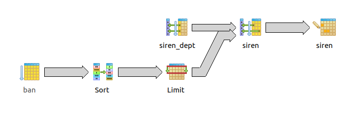

# Proxyret

**Sujet : ** Permettre la recherche et l'affichage de sociétés en fonction de critères de recherche (localisation, activité).

##Les données##

Les données de ce projet sont :

- la base adresse nationale,
- la base SIRENE,
- un json crawling/parsing des entreprises du 93.

###BAN Base Adresses Nationale###

La base adresse nationale fournie une archive de 1 Go contenant autant de fichiers *csv* que de départements.
L'ensemble des 102 fichiers font 4.5Go. Pour exemple, le fichier correspondant au département 93 fait 40 Mo.

Les différentes champs sont donc les suivants : 

- **id** : identifiant de la BD Adresse
- **nom_voie** : nom de la voie
- id_fantoir : identifiant Fantoir
- **numero** : numéro dans la voie
- **rep** : indice de répétition
- **code_insee** : code INSEE
- code_post : code Postal
- alias : nom en langue régionale, et/ou différent de l'officiel
- nom_ld : nom du lieu-dit
- **nom_afnor** : nom normalisé selon la norme postale
- libelle_acheminement : nom de la commune d'acheminement
- **x** : coordonnée en Lambert 93 EPSG:2154
- **y** : coordonnée en Lambert 93 EPSG:2154
- **lon** : longitude en WGS85 EPSG:4326
- **lat** : latitude en WGS85 EPSG:4326
- **nom_commune** : nom officiel de la commune

*En gras, les champs présentant un intérêt supérieur.

**Un exemple :**

```csv
id;nom_voie;id_fantoir;numero;rep;code_insee;code_post;alias;nom_ld;nom_afnor;libelle_acheminement;x;y;lon;lat;nom_commune
ADRNIVX_0000000276535697;;A045;152;"";33199;33470;"";LE VILLAGE DES PINS;;GUJAN MESTRAS;374053.7;6399654.5;-1.11036564643895;44.6196154013104;Gujan-Mestras
```

###SIRENE###

La base SIRENE est fournie en un fichier unique, au format *csv*, avec une fréquence de mise à jour mensuelle.
Des fichiers de mise à jour régulière sont aussi disponible. Nous utiliserons ici le fichier global de 8.5Go et disponible compressé sur le site open data d'une taille de 1.5 Go.

Ce fichier est d'une qualité très particulière, il est aussi à noter que les types des champs ne sont pas particulièrement judicieux (quasiment que du type caractères).
Il est composé de 100 champs ! Ils ne seront donc pas listés en intégralité ici. Voici la liste des plus intéressants :

- **SIREN** : identifiant de l'entreprise
- **NIC** : identifiant de l'établissement
- {...}
- **NUMVOIE** : numéro dans la voie
- **INDREP** : indice de répétition
- **TYPVOIE** : type de voie
- **LIBVOIE** : libellé de la voie
- **CODPOS** : code postal
- {...}
- **DEPET** : code du département
- {...}
- **COMET** : code de la commune au sein du département
- **LIBCOM** : libellé de la commune
- {...}
- ENSEIGNE : Nom d'exploitation
- {...}
- NATETAB : nature de l'établissement
- LIBNATETAB : libellé de la nature de l'établissement
- **APET700** : activité principale de l'établissement
- **LIBAPET** : libellé de l'activité principale de l'établissement
- {...}
- **NOMEN_LONG** : raison sociale
- SIGLE : sigle de l'entreprise
- {...}
- APEN700 : activité principale de l'entreprise
- LIBAPEN : libellé de l'activité principale de l'entreprise
- {...}

**Un exemple :**

```csv
"SIREN";"NIC";"L1_NORMALISEE";"L2_NORMALISEE";"L3_NORMALISEE";"L4_NORMALISEE";"L5_NORMALISEE";"L6_NORMALISEE";"L7_NORMALISEE";"L1_DECLAREE";"L2_DECLAREE";"L3_DECLAREE";"L4_DECLAREE";"L5_DECLAREE";"L6_DECL
AREE";"L7_DECLAREE";"NUMVOIE";"INDREP";"TYPVOIE";"LIBVOIE";"CODPOS";"CEDEX";"RPET";"LIBREG";"DEPET";"ARRONET";"CTONET";"COMET";"LIBCOM";"DU";"TU";"UU";"EPCI";"TCD";"ZEMET";"SIEGE";"ENSEIGNE";"IND_PUBLIPO"
;"DIFFCOM";"AMINTRET";"NATETAB";"LIBNATETAB";"APET700";"LIBAPET";"DAPET";"TEFET";"LIBTEFET";"EFETCENT";"DEFET";"ORIGINE";"DCRET";"DDEBACT";"ACTIVNAT";"LIEUACT";"ACTISURF";"SAISONAT";"MODET";"PRODET";"PROD
PART";"AUXILT";"NOMEN_LONG";"SIGLE";"NOM";"PRENOM";"CIVILITE";"RNA";"NICSIEGE";"RPEN";"DEPCOMEN";"ADR_MAIL";"NJ";"LIBNJ";"APEN700";"LIBAPEN";"DAPEN";"APRM";"ESS";"DATEESS";"TEFEN";"LIBTEFEN";"EFENCENT";"D
EFEN";"CATEGORIE";"DCREN";"AMINTREN";"MONOACT";"MODEN";"PRODEN";"ESAANN";"TCA";"ESAAPEN";"ESASEC1N";"ESASEC2N";"ESASEC3N";"ESASEC4N";"VMAJ";"VMAJ1";"VMAJ2";"VMAJ3";"DATEMAJ"

"000325175";"00057";"TAHITI PERLES CREATION";"MONSIEUR THIERRY JANOYER";"";"61 RUE MARX DORMOY";"";"13004 MARSEILLE";"FRANCE";"MONSIEUR THIERRY JANOYER";"TAHITI PERLES CREATION";"";"61 RUE MARX DORMOY";""
;"13004 MARSEILLE 4";"";"61";"";"RUE";"MARX DORMOY";"13004";"";"93";"Provence-Alpes-Côte d'Azur";"13";"3";"98";"204";"MARSEILLE 4";"00";"7";"59";"200054807";"73";"9310";"1";"TAHITI PERLES CREATION";"1";"O
";"201401";"3";"Artisan ";"3212Z";"Fabrication d'articles de joaillerie et bijouterie";"2014";"00";"0 salarié";"NN";"2014";"1";"20140107";"20140107";"";"";"";"P";"S";"O";"";"0";"JANOYER*THIERRY/";"";"JANO
YER";"THIERRY";"1";"";"00057";"93";"13204";"";"";"";"3212Z";"Fabrication d'articles de joaillerie et bijouterie";"2008";"";"";"";"00";"0 salarié";"NN";"2014";"PME";"20000926";"201209";"1";"S";"O";"";"";""
;"";"";"";"";"";"";"";"";"2014-01-08T00:00:00"
"005420021";"00056";"ETABLISSEMENTS LUCIEN BIQUEZ";"";"";"21 B BOULEVARD DES PRES";"";"80100 ABBEVILLE";"FRANCE";"ETABLISSEMENTS LUCIEN BIQUEZ";"";"";"21 B BD DES PRES";"";"80100 ABBEVILLE";"";"21";"B";"B
D";"DES PRES";"80100";"";"32";"Nord-Pas-de-Calais-Picardie";"80";"1";"98";"001";"ABBEVILLE";"80";"4";"01";"248000556";"41";"2209";"1";"";"1";"O";"201209";"";"";"4669B";"Commerce de gros de fournitures et 
équipements industriels divers";"2009";"11";"10 à 19 salariés";"10";"2009";"1";"20091223";"20091223";"";"";"";"P";"S";"O";"";"0";"ETABLISSEMENTS LUCIEN BIQUEZ";"";"";"";"";"";"00056";"32";"80001";"";"5710
";"SAS, société par actions simplifiée";"4669B";"Commerce de gros de fournitures et équipements industriels divers";"2008";"";"";"";"11";"10 à 19 salariés";"10";"2009";"PME";"19540101";"201209";"1";"S";"O
";"";"";"";"";"";"";"";"";"";"";"";"2011-07-19T00:00:00"
"005420120";"00015";"SOCIETE DES SUCRERIES DU MARQUENTERRE";"";"";"RUE DE LA FONTAINE";"";"80120 RUE";"FRANCE";"SOCIETE DES SUCRERIES DU MARQUENTERRE";"";"";"RUE DE LA FONTAINE";"";"80120 RUE";"";"";"";"R
UE";"DE LA FONTAINE";"80120";"";"32";"Nord-Pas-de-Calais-Picardie";"80";"1";"23";"688";"RUE";"80";"1";"13";"200011997";"17";"2209";"0";"";"1";"O";"201209";"";"";"1081Z";"Fabrication de sucre";"2008";"02";
"3 à 5 salariés";"3";"2015";"1";"19890127";"19890127";"NR";"99";"";"P";"S";"O";"";"0";"SOCIETE DES SUCRERIES DU MARQUENTERRE";"";"";"";"";"";"00031";"32";"62550";"";"5599";"SA à conseil d'administration (
s.a.i.)";"7010Z";"Activités des sièges sociaux";"2014";"";"";"";"11";"10 à 19 salariés";"10";"2015";"PME";"19540101";"201209";"3";"S";"O";"2012";"0";"7010Z";"7010Z";"";"";"";"";"";"";"";"1997-09-02T00:00:
00"
```

##Les diagrammes EA##

[Description des diagrammes EA](./diagrammes/README.md)

##La base de données##

Le SGBD utilisé pour ce projet est PostgreSQL.
Les extensions sont :

- PostGIS : pour la gestion des géométries,
- Fuzzystrmatch : pour bénéficier des fonctions, telle levenshtein distance.

La première étape consiste à créer la base de données

###Création de la base de données###

```sh
user@server$sudo su postgresql
postgresql@server$psql
psql (9.3.15)
Type "help" for help.

##Liste des tables existantes##
postgres= \l 
                                   List of databases
   Name    |   Owner    | Encoding |   Collate   |    Ctype    |   Access privileges
-----------+------------+----------+-------------+-------------+-----------------------
 postgres  | postgres   | UTF8     | fr_FR.UTF-8 | fr_FR.UTF-8 | 
 template0 | postgres   | UTF8     | fr_FR.UTF-8 | fr_FR.UTF-8 | =c/postgres          +
           |            |          |             |             | postgres=CTc/postgres
 template1 | postgres   | UTF8     | fr_FR.UTF-8 | fr_FR.UTF-8 | =c/postgres          +
           |            |          |             |             | postgres=CTc/postgres
(3 rows)

postgres= CREATE DATABASE bigdata;
CREATE DATABASE
postgres= \c bigdata ##Connexion à la base ainsi créée##
You are now connected to database "bigdata" as user "postgres".

##Activation de l'extension PostGIS##
bigdata= CREATE EXTENSION postgis;
```

Il est aussi possible de créer un nouvel utilisateur.

###Création d'un utilisateur###

```sh
postgres= CREATE ROLE username UNENCRYPTED PASSWORD 'motDePasseEnClair' LOGIN SUPERUSER CREATEDB CREATEROLE; 
CREATE ROLE

##Liste des utilisateurs##
postgres= \du
                              List of roles
 Role name  |                   Attributes                   | Member of 
------------+------------------------------------------------+-----------
 postgres    | Superuser, Create role, Create DB, Replication | {}
 username  | Superuser, Create role, Create DB              | {}

postgres=# 
```

###Création des tables###

En fonction des deux bases de travail, ont été réalisé les tables correspondantes.

####BAN####

```sql
CREATE TABLE ban (
  id character varying(30) NOT NULL,
  nom_voie character varying(255) DEFAULT NULL,
  id_fantoir character varying(5),
  numero character varying(5) DEFAULT NULL,
  rep character varying(25) DEFAULT NULL,
  code_insee character varying(5) NOT NULL,
  code_post character varying(5) NOT NULL,
  alias character varying(50) DEFAULT NULL,
  nom_ld character varying(50) DEFAULT NULL,
  nom_afnor character varying(50),
  libelle_acheminement character varying(50),
  x numeric(10,2),
  y numeric(10,2),
  lon numeric(16,14),
  lat numeric(16,14),
  nom_commune character varying(255) NOT NULL,
  CONSTRAINT ban_pk PRIMARY KEY (id)
);
```

####SIRENE####

```sql
CREATE TABLE siren (
  siren character varying(9) NOT NULL,
  nic character varying(5) NOT NULL,
  l1_normalisee character varying(38),
  l2_normalisee character varying(38),
  l3_normalisee character varying(38),
  l4_normalisee character varying(38),
  l5_normalisee character varying(38),
  l6_normalisee character varying(38),
  l7_normalisee character varying(38),
  l1_declaree character varying(38),
  l2_declaree character varying(38),
  l3_declaree character varying(38),
  l4_declaree character varying(38),
  l5_declaree character varying(38),
  l6_declaree character varying(38),
  l7_declaree character varying(38),
  numvoie character varying(4),
  indrep character varying(1),
  typvoie character varying(4),
  libvoie character varying(32) DEFAULT NULL,
  codpos character varying(5) NOT NULL,
  cedex character varying(5) NOT NULL,
  rpet character varying(2),
  libreg character varying(70),
  depet character varying(2) NOT NULL,
  arronet character varying(2) DEFAULT NULL,
  ctonet character varying(3) DEFAULT NULL,
  comet character varying(3) NOT NULL,
  libcom character varying(32) NOT NULL,
  du character varying(2),
  tu character varying(1),
  uu character varying(2),
  epci character varying(9) DEFAULT NULL,
  tcd character varying(2),
  zemet character varying(4),
  siege character varying(1),
  enseigne character varying(50) NOT NULL,
  ind_publipo character varying(1),
  diffcom character varying(1) NOT NULL,
  amintret character varying(6),
  natetab character varying(1),
  libnatetab character varying(30) NOT NULL,
  apet700 character varying(5) NOT NULL,
  libapet character varying(65) NOT NULL,
  dapet character varying(4),
  tefet character varying(2) NOT NULL,
  libtefet character varying(23) NOT NULL,
  efetcent character varying(6) NOT NULL,
  defet character varying(4),
  origine character varying(2),
  dcret character varying(8),
  ddebact character varying(8),
  activnat character varying(2),
  lieuact character varying(2),
  actisurf character varying(2),
  saisonat character varying(2) NOT NULL,
  modet character varying(1) NOT NULL,
  prodet character varying(1) NOT NULL,
  prodpart character varying(1),
  auxilt character varying(1),
  nomen_long character varying(131) NOT NULL,
  sigle character varying(20),
  nom character varying(100) NOT NULL,
  prenom character varying(30) NOT NULL,
  civilite character varying(1),
  rna character varying(10),
  nicsiege character varying(5),
  rpen character varying(2),
  depcomen character varying(5),
  adr_mail character varying(80) DEFAULT NULL,
  nj character varying(4) NOT NULL,
  libnj character varying(100) NOT NULL,
  apen700 character varying(5) NOT NULL,
  libapen character varying(65) NOT NULL,
  dapen character varying(4),
  aprm character varying(6),
  ess character varying(1),
  dateess character varying(8),
  tefen character varying(2) NOT NULL,
  libtefen character varying(23) NOT NULL,
  efencent character varying(6) NOT NULL,
  defen character varying(4),
  categorie character varying(5) NOT NULL,
  dcren character varying(8),
  amintren character varying(6),
  monoact character varying(1),
  moden character varying(1),
  proden character varying(1),
  esaann character varying(4),
  tca character varying(1),
  esaapen character varying(5),
  esasec1n character varying(5),
  esasec2n character varying(5),
  esasec3n character varying(5),
  esasec4n character varying(5),
  vmaj character varying(1) NOT NULL,
  vmaj1 character varying(1),
  vmaj2 character varying(1),
  vmaj3 character varying(1),
  datemaj character varying(19),
  CONSTRAINT siren_pk PRIMARY KEY (siren, nic)
);
```

###L'import des données###

Les données étant en *csv*, les imports seront effectués avec la commande **COPY** de psql.
Pour ce faire, il faut se connecter à la base de données.
Les paramètres utilisés sont :

- FROM 'path' : où path est le chemin complet avec le fichier et son extension,
- DELIMITER 'x' : où x est le délimiteur utilisé dans le fichier {,;/|},
- HEADER : pour signifier que le fichier contient en première ligne une en-tête qui ne doit pas être importée,
- ENCODING 'x' : où x est l'encodage du fichier.

**Exemple de commande :**
COPY table FROM './directory/file.csv' DELIMITER ';' CSV HEADER ENCODING 'UTF8';

####BAN####

```sh
bigdata= COPY ban FROM './Projet_BigData/BAN_93.csv' DELIMITER ';' CSV HEADER;
COPY 230046
Time: 9450,544 ms
```

**Vérification**

```SQL
SELECT * FROM ban LIMIT 1;

            id            | nom_voie | id_fantoir | numero | rep | code_insee | code_post | alias |            nom_ld            | nom_afnor | libelle_acheminement |   x    |     y     |       lon        |       lat        | nom_commune 
--------------------------+----------+------------+--------+-----+------------+-----------+-------+------------------------------+-----------+----------------------+--------+-----------+------------------+------------------+-------------
 ADRNIVX_0000000358919390 |          | A001       | 9001   |     | 93030      | 93440     |       | AEROPORT DE PARIS-LE BOURGET |           | DUGNY                | 658969 | 6872696.9 | 2.43975407716647 | 48.9529224984577 | Dugny
```

####SIRENE####

```sh
bigdata= COPY siren FROM './Projet_BigData/sirc_20170201_152507836.csv' DELIMITER ';' CSV HEADER ENCODING 'LATIN1';
COPY 10563603
Time: 1029392,563 ms
```

**Vérification**

```SQL
SELECT * FROM siren LIMIT 1;

   siren   |  nic  | l1_normalisee | l2_normalisee | l3_normalisee |   l4_normalisee    | l5_normalisee |  l6_normalisee  | l7_normalisee | l1_declaree | l2_declaree | l3_declaree |    l4_declaree    | l5_declaree |   l6_declaree   | l7_declaree | numvoie | indrep | typvoie |      libvoie      | codpos | cedex | rpet |              libreg               | depet | arronet | ctonet | comet |  libcom   | du | tu | uu |   epci    | tcd | zemet | siege | enseigne | ind_publipo | diffcom | amintret | natetab | libnatetab | apet700 |                        libapet                         | dapet | tefet |    libtefet    | efetcent | defet | origine |  dcret   | ddebact  | activnat | lieuact | actisurf | saisonat | modet | prodet | prodpart | auxilt | nomen_long | sigle | nom | prenom | civilite | rna | nicsiege | rpen | depcomen | adr_mail |  nj  |                                               libnj                                               | apen700 |                        libapen                         | dapen | aprm | ess | dateess | tefen |        libtefen        | efencent | defen | categorie |  dcren   | amintren | monoact | moden | proden | esaann | tca | esaapen | esasec1n | esasec2n | esasec3n | esasec4n | vmaj | vmaj1 | vmaj2 | vmaj3 |       datemaj
-----------+-------+---------------+---------------+---------------+--------------------+---------------+-----------------+---------------+-------------+-------------+-------------+-------------------+-------------+-----------------+-------------+---------+--------+---------+-------------------+--------+-------+------+-----------------------------------+-------+---------+--------+-------+-----------+----+----+----+-----------+-----+-------+-------+----------+-------------+---------+----------+---------+------------+---------+--------------------------------------------------------+-------+-------+----------------+----------+-------+---------+----------+----------+----------+---------+----------+----------+-------+--------+----------+--------+------------+-------+-----+--------+----------+-----+----------+------+----------+----------+------+---------------------------------------------------------------------------------------------------+---------+--------------------------------------------------------+-------+------+-----+---------+-------+------------------------+----------+-------+-----------+----------+----------+---------+-------+--------+--------+-----+---------+----------+----------+----------+----------+------+-------+-------+-------+---------------------
 300345808 | 00822 | NAF NAF       |               |               | CENTRE COMMERCIAL  |               | 57280 SEMECOURT | FRANCE        | NAF NAF     | NAF NAF     |             | CENTRE COMMERCIAL |             | 57280 SEMECOURT |             |         |        |         | CENTRE COMMERCIAL | 57280  |       | 44   | Alsace-Champagne-Ardenne-Lorraine | 57    | 9       | 24     | 645   | SEMECOURT | 57 | 7  | 01 | 200039949 | 12  | 4107  | 0     | NAF NAF  | 1           | O       | 201209   |         |            | 4771Z   | Commerce de détail d'habillement en magasin spécialisé | 2009  | 02    | 3 à 5 salariés | 3        | 2015  | 9       | 20090901 | 20090901 | 10       | 05      |          | P        | S     | O      |          | 0      | NAF NAF    |       |     |        |          |     | 00129    | 11   | 93031    |          | 5720 | Société par actions simplifiée à associé unique ou société par actions simplifiée unipersonnelle  | 4771Z   | Commerce de détail d'habillement en magasin spécialisé | 2009  |      |     |         | 42    | 1 000 à 1 999 salariés | 1000     | 2015  | GE        | 19740101 | 201209   | 2       | S     | O      | 2012   | 8   | 4771Z   | 4771Z    |          |          |          |      |       |       |       | 2009-10-14T00:00:00

```

###Constatations et Modifications###

Nous nous apercevons que certaines informations ne sont pas directement présentent dans les tables. Nous allons donc ajouter des champs afin d'avoir certains informations directement.

####BAN####

**Ajout du champ geom**

Afin d'avoir l'affichage ultérieurement dans un outil, tel que qGIS, ou de réaliser des calculs sur la localisation, nous avons besoin d'un champ de géométrie.

```sql
ALTER TABLE ban
	ADD COLUMN geom geometry(Point,4326);	
```

**Mise à jour du champ geom**

```sql
UPDATE ban
SET geom = ST_SetSRID(ST_Point(lon, lat), 4326)
WHERE geom IS NULL;
--UPDATE 230046
--Time: 25141,886 ms
```

####SIRENE####

**Ajout du champ code_insee**

Afin de limiter les requêtes, nous utiliserons des contraintes sur le code_insee des sociétés et des adresses.

```sql
ALTER TABLE siren
	ADD COLUMN code_insee character varying(5);
```

**Mise à jour du champ code_insee**

```sql
UPDATE siren
SET code_insee = CONCAT(depet, comet);
--UPDATE 10563603
--Time: 1787948,350 ms
```

**Ajout du champ banid**

Lorque nous géoréférencerons les sociétés, nous ajouterons l'id de l'adresse dans la table siren, il faut donc ajouter un tel champ.

```sql
ALTER TABLE siren
	ADD COLUMN banid character varying(30);
```

**Mise à jour du champ code_insee**

Cette opération sera effectuée par géocodage.
Les données relatives à la localisation n'étant pas identiques entre les deux tables, nous allons utiliser un algorithme qui permettra de trouver l'adresse de la BAN la plus proche littéralement de l'adresse du SIRENE.
En ajoutant l'extension *[Fuzzystrmatch](https://www.postgresql.org/docs/current/static/fuzzystrmatch.html)* à notre base, nous pourrons ainsi utiliser la fonction *levenshtein*.
```sql
CREATE EXTENSION fuzzystrmatch;
levenshtein(text source, text target) returns int
```

Cette fonction retourne un entier qui représente la nombre d'ajout/suppression de caractères à effectuer à la chaine une pour obtenir la deuxième. Elle est sensible à la casse, pour cette raison, nous devrons passer les chaines de caractères à une casse identique.

La requête utilisée recherche l'adresse BAN la plus proche de celle du Sirene, un contrainte est mise pour limiter une distance de Levenshtein inférieure à 8.
Une deuxième requête est faite pour les *avenue* et *boulevard*, car abrégés dans le sirene, ils augmentent la distance de Levenshtein qui sera contrainte à moins de 12.

En procédant de la sorte, nous obtenons 3% de déchet. Il serait tentant de lever cette contrainte, ainsi nous obtiendrons un taux de succès de 100% mais au détriment de la qualité du géoréférencement.

```sql
UPDATE siren s
SET banid = (SELECT b.id
	FROM ban b
	WHERE b.code_insee = s.code_insee
	AND levenshtein(LOWER(CONCAT(s.numvoie, ' ', s.typvoie, ' ', s.libvoie)), LOWER(CONCAT(b.numero, b.nom_voie))) < 8
	ORDER BY levenshtein(LOWER(CONCAT(s.numvoie, ' ', s.typvoie, ' ', s.libvoie)), LOWER(CONCAT(b.numero, b.nom_voie)))
	LIMIT 1)
WHERE depet = '93' AND banid IS NULL;
```
EXPLAIN de la requête précédente :



###Les Index###

####BAN####

```sql
CREATE INDEX ban_insee ON ban
	USING btree (code_insee);
	
CREATE INDEX ban_id ON ban
	USING btree (id);
```

####SIRENE####

```sql
CREATE INDEX siren_dept ON siren
  USING btree (depet);
CREATE INDEX
Time: 777214,730 ms
  
CREATE INDEX siren_code_insee ON siren
  USING btree (code_insee);
```

##Benchmark##

[Benchmark](./database/ReadMe.md)

###Option###

Il est possible de créer une table ne contenant que les données relatives au 93 et en restreignant le nombre de colonnes.

```sql
CREATE TABLE siren93 AS SELECT SIREN, NIC, NUMVOIE, INDREP, TYPVOIE, LIBVOIE, CODPOS, DEPET, COMET, LIBCOM, ENSEIGNE, NATETAB, LIBNATETAB, APET700, LIBAPET, NOMEN_LONG, SIGLE, APEN700, LIBAPEN FROM siren WHERE depet = '93';
```