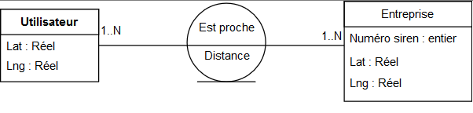
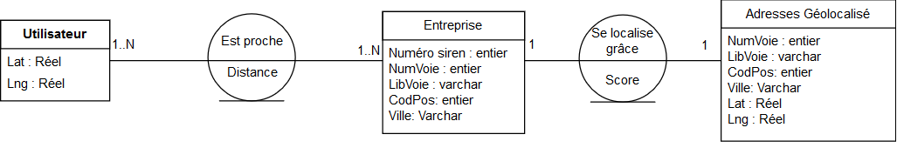

# Description des diagrammes EA

## Proposition 1

Un utilisateur possède une localisation(Lat,Lng)  
Une entreprise possède un numéro SIREN et une localisation(Lat,Lng)  
Un utilisateur est proche d'une entreprise, cela est relatif donc cette liaison est reliée à une distance

## Proposition 2 

Un utilisateur possède une localisation(Lat,Lng)  
Une entreprise possède un numéro SIREN et une adresse(Numéro siren, NumVoie, LibVoie, CodPos, Ville)  
Une adresse géolocalisée possède une adresse(Numéro siren, NumVoie, LibVoie, CodPos, Ville) et une localisation(Lat,Lng)  

Un utilisateur est proche d'une entreprise, cela est relatif donc cette liaison est reliée à une distance  
Une entreprise se localise grâce à une adresse géolocalisée, cette association est reliée à un score de ressemblance
